<p align="center">
  <h1 align="center">🔨 FlutterForge</h1>
  <p align="center">Production-ready Flutter project template with clean architecture, Riverpod & comprehensive tooling</p>
</p>

<p align="center">
  <a href="https://github.com/muhittincamdali/FlutterForge/actions/workflows/ci.yml">
    
  </a>
  <a href="https://github.com/muhittincamdali/FlutterForge/blob/main/LICENSE">
    
  </a>
  <a href="https://github.com/muhittincamdali/FlutterForge/stargazers">
    
  </a>
  <a href="https://flutter.dev">
    
  </a>
  <a href="https://dart.dev">
    
  </a>
  <a href="https://github.com/muhittincamdali/FlutterForge/issues">
    
  </a>
</p>

---

## 📋 Table of Contents

- [Overview](#-overview)
- [Features](#-features)
- [Architecture](#-architecture)
- [Project Structure](#-project-structure)
- [Getting Started](#-getting-started)
- [Configuration](#-configuration)
- [State Management](#-state-management)
- [Networking](#-networking)
- [Routing](#-routing)
- [Theming](#-theming)
- [Storage](#-storage)
- [Testing](#-testing)
- [Code Generation](#-code-generation)
- [Contributing](#-contributing)
- [License](#-license)

---

## 🌟 Overview

**FlutterForge** is a battle-tested Flutter project template designed for teams and solo developers who want to start new projects with a solid foundation. It implements clean architecture principles with feature-first organization, Riverpod for state management, and includes everything you need out of the box.

### Why FlutterForge?

| Problem | Solution |
|---------|----------|
| Hours spent setting up new projects | Ready in minutes with pre-configured architecture |
| Inconsistent code patterns across team | Enforced clean architecture with clear boundaries |
| No standard for state management | Riverpod with providers, notifiers, and dependency injection |
| Boilerplate networking code | Dio wrapper with auth, logging, and retry interceptors |
| Missing test infrastructure | Pre-configured test setup with mocking utilities |
| Theme inconsistency | Comprehensive design system with light/dark support |

---

## ✨ Features

### Core Architecture
- 🏗️ **Clean Architecture** — Domain, Data, and Presentation layers
- 📦 **Feature-First Structure** — Scalable project organization
- 🔄 **Riverpod State Management** — Type-safe, testable, and composable
- 🧭 **GoRouter Navigation** — Declarative routing with deep link support
- 🌐 **Dio HTTP Client** — Interceptors for auth, logging, and retry
- 💾 **Hive Local Storage** — Fast, lightweight key-value database
- 🔐 **Secure Storage** — Encrypted storage for sensitive data
- 🎨 **Material 3 Theming** — Complete light and dark theme system

### Developer Experience
- 🧊 **Freezed Models** — Immutable data classes with union types
- 📝 **Form Validation** — Comprehensive validator utilities
- 🔧 **Extensions** — Useful extensions on BuildContext and String
- 📊 **Structured Logging** — Colored, leveled logging system
- 🧪 **Test Setup** — Unit and widget test infrastructure
- 📏 **Strict Analysis** — Very Good Analysis with custom rules

### Production Ready
- 🚀 **CI/CD Pipeline** — GitHub Actions for analyze, test, and build
- 📋 **Issue Templates** — Bug report and feature request templates
- 🤝 **Contributing Guide** — Clear contribution guidelines
- 🔒 **Security Policy** — Responsible disclosure process
- 📖 **Full Documentation** — Comprehensive README and inline docs

---

## 🏗 Architecture

FlutterForge follows **Clean Architecture** with three distinct layers:

```mermaid
graph TB
    subgraph Presentation["🎨 Presentation Layer"]
        Screens["Screens"]
        Widgets["Widgets"]
        Providers["Providers/Notifiers"]
    end

    subgraph Domain["📐 Domain Layer"]
        Entities["Entities"]
        Repositories["Repository Interfaces"]
        UseCases["Use Cases"]
    end

    subgraph Data["💾 Data Layer"]
        RepoImpl["Repository Implementations"]
        Models["Data Models"]
        DataSources["Remote/Local Data Sources"]
    end

    Screens --> Providers
    Providers --> UseCases
    UseCases --> Repositories
    RepoImpl --> Repositories
    RepoImpl --> Models
    RepoImpl --> DataSources
    Models --> Entities
```



### Layer Responsibilities

#### Presentation Layer
- **Screens**: Full-page widgets that compose smaller widgets
- **Widgets**: Reusable UI components specific to a feature
- **Providers**: Riverpod providers and state notifiers

#### Domain Layer
- **Entities**: Core business objects (pure Dart classes)
- **Repository Interfaces**: Abstract contracts for data access
- **Use Cases**: Single-responsibility business logic units

#### Data Layer
- **Repository Implementations**: Concrete implementations
- **Models**: Data transfer objects with serialization
- **Data Sources**: API clients, local databases, etc.

---

## 📁 Project Structure

```
lib/
├── main.dart                          # App entry point
├── app.dart                           # MaterialApp.router configuration
├── core/
│   ├── di/
│   │   └── injection.dart             # Riverpod dependency providers
│   ├── extensions/
│   │   ├── context_extensions.dart    # BuildContext extensions
│   │   └── string_extensions.dart     # String utility extensions
│   ├── network/
│   │   ├── api_client.dart            # Dio HTTP client wrapper
│   │   └── interceptors/
│   │       ├── auth_interceptor.dart  # JWT token management
│   │       ├── logging_interceptor.dart
│   │       └── retry_interceptor.dart # Exponential backoff
│   ├── router/
│   │   ├── app_router.dart            # GoRouter configuration
│   │   └── route_names.dart           # Route name constants
│   ├── storage/
│   │   ├── local_storage.dart         # Hive wrapper
│   │   └── secure_storage.dart        # Encrypted storage
│   ├── theme/
│   │   ├── app_colors.dart            # Color palette
│   │   ├── app_theme.dart             # ThemeData configuration
│   │   └── app_typography.dart        # Text styles
│   └── utils/
│       ├── logger.dart                # Structured logging
│       └── validators.dart            # Form field validators
├── features/
│   ├── auth/
│   │   ├── data/
│   │   │   ├── models/
│   │   │   │   └── user_model.dart    # Freezed user model
│   │   │   └── repositories/
│   │   │       └── auth_repository_impl.dart
│   │   ├── domain/
│   │   │   ├── entities/
│   │   │   │   └── user.dart          # User entity
│   │   │   ├── repositories/
│   │   │   │   └── auth_repository.dart
│   │   │   └── usecases/
│   │   │       └── login_usecase.dart
│   │   └── presentation/
│   │       ├── providers/
│   │       │   └── auth_provider.dart
│   │       ├── screens/
│   │       │   ├── login_screen.dart
│   │       │   └── register_screen.dart
│   │       └── widgets/
│   │           └── auth_form.dart
│   ├── home/
│   │   └── presentation/
│   │       ├── screens/
│   │       │   └── home_screen.dart
│   │       └── widgets/
│   │           └── home_card.dart
│   └── settings/
│       └── presentation/
│           └── screens/
│               └── settings_screen.dart
└── shared/
    └── widgets/
        ├── app_button.dart
        ├── app_text_field.dart
        ├── error_widget.dart
        └── loading_overlay.dart
```

---

## 🚀 Getting Started

### Prerequisites

- [Flutter SDK](https://flutter.dev/docs/get-started/install) >= 3.10.0
- [Dart SDK](https://dart.dev/get-dart) >= 3.0.0
- A code editor (VS Code recommended)

### Installation

1. **Clone the repository**

```bash
git clone https://github.com/muhittincamdali/FlutterForge.git
cd FlutterForge
```

2. **Install dependencies**

```bash
flutter pub get
```

3. **Run code generation**

```bash
dart run build_runner build --delete-conflicting-outputs
```

4. **Run the app**

```bash
flutter run
```

### Quick Start Commands

```bash
# Analyze code
flutter analyze

# Run tests
flutter test

# Run tests with coverage
flutter test --coverage

# Format code
dart format lib/ test/

# Generate code (freezed, json_serializable, riverpod)
dart run build_runner build -d

# Watch for changes and regenerate
dart run build_runner watch -d
```

---

## ⚙️ Configuration

### Environment Setup

Create a `.env` file in the project root:

```env
API_BASE_URL=https://api.example.com
API_TIMEOUT=30000
ENABLE_LOGGING=true
```

### API Client Configuration

The `ApiClient` class supports extensive configuration:

```dart
final client = ApiClient(
  baseUrl: 'https://api.example.com',
  connectTimeout: const Duration(seconds: 30),
  receiveTimeout: const Duration(seconds: 30),
  enableLogging: true,
  maxRetries: 3,
);
```

---

## 🔄 State Management

FlutterForge uses **Riverpod** for state management. Here's a quick overview:

### Provider Types

```dart
// Simple value provider
final counterProvider = StateProvider<int>((ref) => 0);

// Async data provider
final usersProvider = FutureProvider<List<User>>((ref) async {
  final repository = ref.watch(userRepositoryProvider);
  return repository.getUsers();
});

// Notifier for complex state
final authProvider = StateNotifierProvider<AuthNotifier, AuthState>((ref) {
  return AuthNotifier(ref.watch(loginUseCaseProvider));
});
```

### Usage in Widgets

```dart
class MyWidget extends ConsumerWidget {
  const MyWidget({super.key});

  @override
  Widget build(BuildContext context, WidgetRef ref) {
    final authState = ref.watch(authNotifierProvider);

    return switch (authState) {
      AuthInitial() => const LoginScreen(),
      AuthLoading() => const LoadingOverlay(),
      AuthSuccess(:final user) => HomeScreen(user: user),
      AuthFailure(:final message) => AppErrorWidget(message: message),
    };
  }
}
```

---

## 🌐 Networking

### Making API Requests

```dart
// GET request
final response = await apiClient.get<Map<String, dynamic>>(
  '/users/me',
);

// POST request with body
final response = await apiClient.post<Map<String, dynamic>>(
  '/auth/login',
  data: {'email': email, 'password': password},
);

// Multipart upload
final response = await apiClient.upload(
  '/files/upload',
  filePath: '/path/to/file.jpg',
  fieldName: 'avatar',
);
```

### Interceptors

| Interceptor | Purpose |
|------------|---------|
| `AuthInterceptor` | Attaches JWT tokens, handles 401 refresh |
| `LoggingInterceptor` | Logs requests/responses with color coding |
| `RetryInterceptor` | Retries failed requests with exponential backoff |

---

## 🧭 Routing

FlutterForge uses **GoRouter** for declarative navigation:

```dart
// Navigate to a named route
context.goNamed(RouteNames.home);

// Navigate with parameters
context.goNamed(
  RouteNames.userProfile,
  pathParameters: {'id': userId},
);

// Push a new route
context.pushNamed(RouteNames.settings);

// Go back
context.pop();
```

### Route Configuration

Routes are defined in `app_router.dart` with full support for:
- Named routes
- Path parameters
- Query parameters
- Nested navigation
- Route guards (redirect)
- Shell routes for persistent UI

---

## 🎨 Theming

### Color System

```dart
// Access theme colors
final primary = context.colorScheme.primary;
final surface = context.colorScheme.surface;

// Custom app colors
final accent = AppColors.accent;
final success = AppColors.success;
```

### Typography

```dart
// Use predefined text styles
Text(
  'Heading',
  style: context.textTheme.headlineLarge,
);

// Custom typography
Text(
  'Custom',
  style: AppTypography.bodyLarge.copyWith(
    fontWeight: FontWeight.bold,
  ),
);
```

### Theme Switching

```dart
// Toggle theme in settings
ref.read(themeProvider.notifier).toggleTheme();
```

---

## 💾 Storage

### Local Storage (Hive)

```dart
// Store data
await localStorage.put('key', value);

// Retrieve data
final value = localStorage.get<String>('key');

// Delete data
await localStorage.delete('key');

// Clear all
await localStorage.clear();
```

### Secure Storage

```dart
// Store sensitive data
await secureStorage.write(key: 'token', value: jwtToken);

// Read sensitive data
final token = await secureStorage.read(key: 'token');

// Delete sensitive data
await secureStorage.delete(key: 'token');
```

---

## 🧪 Testing

### Running Tests

```bash
# All tests
flutter test

# Specific test file
flutter test test/core/network/api_client_test.dart

# With coverage
flutter test --coverage
genhtml coverage/lcov.info -o coverage/html
open coverage/html/index.html
```

### Test Structure

```
test/
├── core/
│   └── network/
│       └── api_client_test.dart
└── features/
    └── auth/
        └── domain/
            └── usecases/
                └── login_usecase_test.dart
```

### Writing Tests

```dart
void main() {
  late MockAuthRepository mockRepository;
  late LoginUseCase useCase;

  setUp(() {
    mockRepository = MockAuthRepository();
    useCase = LoginUseCase(repository: mockRepository);
  });

  test('should return user on successful login', () async {
    when(() => mockRepository.login(any(), any()))
        .thenAnswer((_) async => testUser);

    final result = await useCase(
      email: 'test@example.com',
      password: 'password123',
    );

    expect(result, equals(testUser));
  });
}
```

---

## 🔨 Code Generation

FlutterForge uses code generation for:

| Package | Purpose | Command |
|---------|---------|---------|
| `freezed` | Immutable data classes | `build_runner build` |
| `json_serializable` | JSON serialization | `build_runner build` |
| `riverpod_generator` | Provider generation | `build_runner build` |

### Generate All

```bash
dart run build_runner build --delete-conflicting-outputs
```

### Watch Mode

```bash
dart run build_runner watch --delete-conflicting-outputs
```

---

## 🤝 Contributing

Contributions are welcome! Please read our [Contributing Guide](CONTRIBUTING.md) for details on our code of conduct and the process for submitting pull requests.

1. Fork the repository
2. Create your feature branch (`git checkout -b feature/amazing-feature`)
3. Commit your changes (`git commit -m 'feat: add amazing feature'`)
4. Push to the branch (`git push origin feature/amazing-feature`)
5. Open a Pull Request

---

## 📄 License

This project is licensed under the MIT License — see the [LICENSE](LICENSE) file for details.

---

## 🙏 Acknowledgments

- [Flutter](https://flutter.dev) — Beautiful native apps in record time
- [Riverpod](https://riverpod.dev) — Reactive state management
- [GoRouter](https://pub.dev/packages/go_router) — Declarative routing
- [Dio](https://pub.dev/packages/dio) — Powerful HTTP client
- [Freezed](https://pub.dev/packages/freezed) — Code generation for immutable classes
- [Hive](https://pub.dev/packages/hive) — Lightweight key-value database

---

<p align="center">
  Made with ❤️ by <a href="https://github.com/muhittincamdali">Muhittin Camdali</a>
</p>
