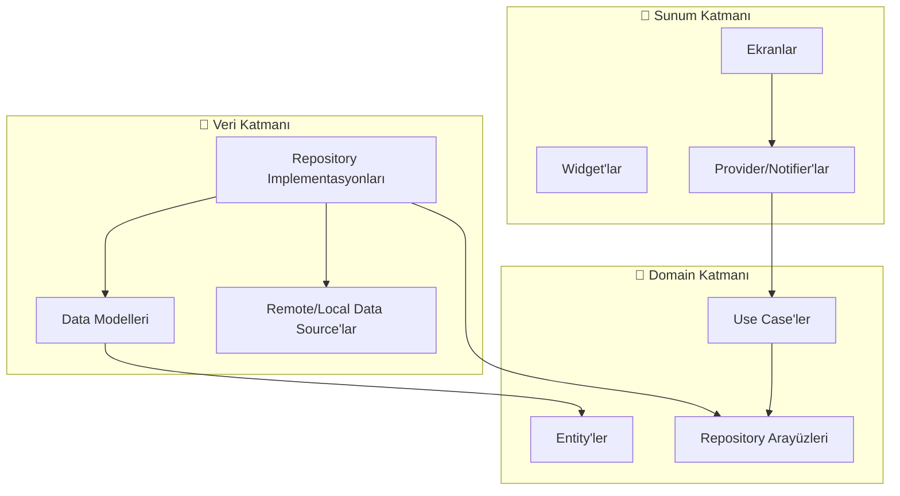

<p align="center">
  <h1 align="center">🔨 FlutterForge</h1>
  <p align="center">Clean architecture, Riverpod ve kapsamlı araçlarla üretime hazır Flutter proje şablonu</p>
</p>

<p align="center">
  <a href="https://github.com/muhittincamdali/FlutterForge/actions/workflows/ci.yml">
    
  </a>
  <a href="https://github.com/muhittincamdali/FlutterForge/blob/main/LICENSE">
    
  </a>
  <a href="https://flutter.dev">
    
  </a>
  <a href="https://dart.dev">
    
  </a>
</p>

---

> 🇬🇧 [English version](README.md)

## 📋 İçindekiler

- [Genel Bakış](#-genel-bakış)
- [Özellikler](#-özellikler)
- [Mimari](#-mimari)
- [Kurulum](#-kurulum)
- [Kullanım](#-kullanım)
- [Katkıda Bulunma](#-katkıda-bulunma)
- [Lisans](#-lisans)

---

## 🌟 Genel Bakış

**FlutterForge**, yeni projelere sağlam bir temel ile başlamak isteyen ekipler ve bireysel geliştiriciler için tasarlanmış, savaşta test edilmiş bir Flutter proje şablonudur. Feature-first organizasyonla clean architecture prensiplerini uygular, state management için Riverpod kullanır ve kutudan çıktığı gibi ihtiyacınız olan her şeyi içerir.

### Neden FlutterForge?

| Sorun | Çözüm |
|-------|-------|
| Yeni proje kurulumunda saatler | Önceden yapılandırılmış mimari ile dakikalar içinde hazır |
| Ekip içi tutarsız kod kalıpları | Net sınırlarla zorunlu clean architecture |
| State management standardı yok | Provider'lar ve notifier'larla Riverpod |
| Boilerplate network kodu | Auth, logging ve retry interceptor'lı Dio wrapper |
| Test altyapısı eksik | Mock araçlarıyla önceden yapılandırılmış test kurulumu |
| Tema tutarsızlığı | Light/dark desteğiyle kapsamlı tasarım sistemi |

---

## ✨ Özellikler

### Temel Mimari
- 🏗️ **Clean Architecture** — Domain, Data ve Presentation katmanları
- 📦 **Feature-First Yapı** — Ölçeklenebilir proje organizasyonu
- 🔄 **Riverpod State Management** — Type-safe, test edilebilir ve birleştirilebilir
- 🧭 **GoRouter Navigasyon** — Deep link desteğiyle deklaratif routing
- 🌐 **Dio HTTP Client** — Auth, logging ve retry interceptor'ları
- 💾 **Hive Yerel Depolama** — Hızlı, hafif key-value veritabanı
- 🔐 **Güvenli Depolama** — Hassas veriler için şifreli depolama
- 🎨 **Material 3 Tema** — Eksiksiz light ve dark tema sistemi

### Geliştirici Deneyimi
- 🧊 **Freezed Modeller** — Union type'larla immutable data class'lar
- 📝 **Form Doğrulama** — Kapsamlı validator araçları
- 🔧 **Extension'lar** — BuildContext ve String üzerinde faydalı extension'lar
- 📊 **Yapılandırılmış Logging** — Renkli, seviyeli logging sistemi
- 🧪 **Test Kurulumu** — Unit ve widget test altyapısı

---

## 🏗 Mimari

FlutterForge üç farklı katmanlı **Clean Architecture** izler:



---

## 🚀 Kurulum

### Gereksinimler

- [Flutter SDK](https://flutter.dev/docs/get-started/install) >= 3.10.0
- [Dart SDK](https://dart.dev/get-dart) >= 3.0.0

### Adımlar

1. **Repoyu klonlayın**

```bash
git clone https://github.com/muhittincamdali/FlutterForge.git
cd FlutterForge
```

2. **Bağımlılıkları yükleyin**

```bash
flutter pub get
```

3. **Kod üretimini çalıştırın**

```bash
dart run build_runner build --delete-conflicting-outputs
```

4. **Uygulamayı başlatın**

```bash
flutter run
```

---

## 📖 Kullanım

### Hızlı Komutlar

```bash
# Kod analizi
flutter analyze

# Testleri çalıştır
flutter test

# Coverage ile test
flutter test --coverage

# Kodu formatla
dart format lib/ test/

# Kod üretimi
dart run build_runner build -d
```

### API İstekleri

```dart
// GET isteği
final response = await apiClient.get<Map<String, dynamic>>('/users/me');

// POST isteği
final response = await apiClient.post<Map<String, dynamic>>(
  '/auth/login',
  data: {'email': email, 'password': password},
);
```

### Navigasyon

```dart
// İsimli rotaya git
context.goNamed(RouteNames.home);

// Parametreli navigasyon
context.goNamed(
  RouteNames.userProfile,
  pathParameters: {'id': userId},
);
```

### Tema Kullanımı

```dart
// Tema renklerine erişim
final primary = context.colorScheme.primary;

// Metin stilleri
Text('Başlık', style: context.textTheme.headlineLarge);
```

---

## 🤝 Katkıda Bulunma

Katkılarınızı bekliyoruz! Lütfen detaylar için [Katkıda Bulunma Rehberi](CONTRIBUTING.md) dosyasını okuyun.

1. Repoyu fork'layın
2. Feature branch'inizi oluşturun (`git checkout -b feature/harika-ozellik`)
3. Değişikliklerinizi commit'leyin (`git commit -m 'feat: harika özellik ekle'`)
4. Branch'e push'layın (`git push origin feature/harika-ozellik`)
5. Pull Request açın

---

## 📄 Lisans

Bu proje MIT Lisansı altında lisanslanmıştır — detaylar için [LICENSE](LICENSE) dosyasına bakın.

---

<p align="center">
  ❤️ ile yapıldı — <a href="https://github.com/muhittincamdali">Muhittin Camdali</a>
</p>
